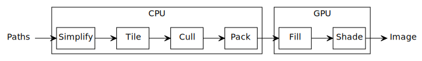

# Pathfinder 3 Architecture

## Rendering pipeline

Quoted timings are for the Ghostscript tiger at 1600×1600 pixels, 8-bit RGBA destination, 2017
MacBook Pro, Intel Core i7-7920HQ CPU @ 3.10GHz, (quad-core with hyperthreading), Intel HD Graphics
630 1536 MB.

### CPU

#### Simplify

Across all paths in parallel:

* Apply transforms.

* Convert strokes to fills.

* Make curves monotonic.

#### Tile

Across all paths in parallel:

* Cut paths into 16×16 tiles.

* Approximate curves with lines.

* Flag tiles that consist entirely of a solid color.

#### Cull

Sequentially (TODO: in parallel):

* Cull tiles occluded by solid-color tiles.

#### Pack

Sequentially:

* Gather up and compress per-instance data produced by the tile pass into batches.

* Upload to GPU.

Approximate CPU time for the tile, cull, and pack passes: 2.2 ms.

### GPU

#### Fill

In parallel:

* Rasterize all edges to an alpha coverage framebuffer (16-bit single-channel floating point).

Approximate GPU time: 2.6 ms.

#### Shade

In parallel:

* Draw solid-color tiles. (Z-buffer is not needed because we did occlusion culling in software.)

* Shade tiles back-to-front using the alpha mask generated during the fill step.

Approximate GPU time: 2.3 ms.

